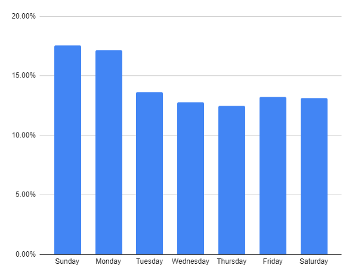

# BigData Analysis - Instacart

## Dataset

The dataset used in this project is available at [Instacart](https://www.instacart.com/datasets/grocery-shopping-2017)


## Data Preparation

Let's connect to the cluster and  start by downloading and extracting the dataset:

```shell
ssh czechflek@hador.ics.muni.cz
wget https://s3.amazonaws.com/instacart-datasets/instacart_online_grocery_shopping_2017_05_01.tar.gz
mv instacart_online_grocery_shopping_2017_05_01.tar.gz\?X-Amz-Expires\=21600  instacart.tar.gz
tar xfz instacart.targ.gz -C data
```

The next step is to transfer the dataset to Hadoop and rename it for convenience:

```shell
 hdfs dfs -put /storage/brno2/home/czechflek/projekt/data/instacart_2017_05_01/
 hdfs dfs -mv instacart_2017_05_01 instacart
 ```

Since we will need each CSV in its own separate folder, we need to create them on HDF and move the files accordingly:

```shell
 hdfs dfs -mkdir instacart/aisles
 hdfs dfs -mv instacart/aisles.csv instacart/aisles/
 # ...and so on
 ```

## Organizing Data in Hive

 Before we can start analysing data, we need to load the datasets to Hive. 

We use the following command to connect to Hive:

 ```shell
 beeline -u "jdbc:hive2://hador-c1.ics.muni.cz:10000/default;principal=hive/hador-c1.ics.muni.cz@ICS.MUNI.CZ"
 ```

Now we can create a new database called `instacart`

```hql
CREATE DATABASE IF NOT EXISTS instacart;
USE instacart;
```

 Since we already loaded all CSVs on the HDFS, we can begin working on creating an external table.

### Tables

#### Aisles

|   Field     | Datatype |
|   -------:  | :------- |
|   aisle_id  |   INT    |
|   aisle     |  STRING  |

Create an external table `aisles__ext`:

```hql
CREATE EXTERNAL TABLE IF NOT EXISTS aisles__ext (
    aisle_id INT,
    aisle STRING)
ROW FORMAT
    DELIMITED FIELDS TERMINATED BY ','
    LINES TERMINATED BY '\n'
STORED AS TEXTFILE
LOCATION '/user/czechflek/instacart/aisles'
tblproperties("skip.header.line.count"="1");
```

Create an optimized parquet table with snappy compression:

```hql
CREATE TABLE IF NOT EXISTS aisles (
    aisle_id INT,
    aisle STRING)
STORED AS PARQUET
tblproperties("parquet.compression"="SNAPPY");
```

Now we can load the data into the new table and drop the external one:

```hql
INSERT OVERWRITE TABLE aisles
SELECT
    aisle_id,
    aisle
FROM aisles__ext;

DROP TABLE aisles__ext;
```

#### Departments

|   Field          | Datatype |
|   ------------:  | :------- |
|   department_id  |   INT    |
|   department     |  STRING  |

Create an external table `departments__ext`:

```hql
CREATE EXTERNAL TABLE IF NOT EXISTS departments__ext (
    department_id INT,
    department STRING)
ROW FORMAT
    DELIMITED FIELDS TERMINATED BY ','
    LINES TERMINATED BY '\n'
STORED AS TEXTFILE
LOCATION '/user/czechflek/instacart/departments'
tblproperties("skip.header.line.count"="1");
```

Create an optimized parquet table with snappy compression:

```hql
CREATE TABLE IF NOT EXISTS departments (
    department_id INT,
    department STRING)
STORED AS PARQUET
tblproperties("parquet.compression"="SNAPPY");
```

Now we can load the data into the new table and drop the external one:

```hql
INSERT OVERWRITE TABLE departments
SELECT
    department_id,
    department
FROM departments__ext;

DROP TABLE departments__ext;
```

#### Products

|   Field          | Datatype |
|   ------------:  | :------- |
|   product_id     |   INT    |
|   product_name   |  STRING  |
|   aisle_id       |   INT    |
|   department_id  |   INT    |

Create an external table `products__ext`:

```hql
CREATE EXTERNAL TABLE IF NOT EXISTS products__ext (
    product_id INT,
    product_name STRING,
    aisle_id INT,
    department_id INT)
ROW FORMAT
    DELIMITED FIELDS TERMINATED BY ','
    LINES TERMINATED BY '\n'
STORED AS TEXTFILE
LOCATION '/user/czechflek/instacart/products'
tblproperties("skip.header.line.count"="1");
```

Create an optimized parquet table with snappy compression:

```hql
CREATE TABLE IF NOT EXISTS products (
    product_id INT,
    product_name STRING,
    aisle_id INT,
    department_id INT)
STORED AS PARQUET
tblproperties("parquet.compression"="SNAPPY");
```

Now we can load the data into the new table and drop the external one:

```hql
INSERT OVERWRITE TABLE products
SELECT
    product_id,
    product_name,
    aisle_id,
    department_id
FROM products__ext;

DROP TABLE products__ext;
```

#### Orders

|   Field                   | Datatype |
|   ------------:           | :------- |
|   order_id                |    INT   |
|   user_id                 |    INT   |
|   eval_set                |  STRING  |
|   order_number            |    INT   |
|   order_dow               |    INT   |
|   order_hour_of_day       |    INT   |
|   days_since_prior_order  |  FLOAT   |

Create an external tablee `orders__ext`:

```hql
CREATE EXTERNAL TABLE IF NOT EXISTS orders__ext (
    order_id INT,
    user_id INT,
    eval_set STRING,
    order_number INT,
    order_dow INT,
    order_hour_of_day INT,
    days_since_prior_order FLOAT)
ROW FORMAT
    DELIMITED FIELDS TERMINATED BY ','
    LINES TERMINATED BY '\n'
STORED AS TEXTFILE
LOCATION '/user/czechflek/instacart/orders'
tblproperties("skip.header.line.count"="1");
```

Create an optimized parquet table with snappy compression:

```hql
CREATE TABLE IF NOT EXISTS orders (
    order_id INT,
    user_id INT,
    eval_set STRING,
    order_number INT,
    order_dow INT,
    order_hour_of_day INT,
    days_since_prior_order FLOAT)
STORED AS PARQUET
tblproperties("parquet.compression"="SNAPPY");
```

Now we can load the data into the new table and drop the external one:

```hql
INSERT OVERWRITE TABLE orders
SELECT
    order_id,
    user_id,
    eval_set,
    order_number,
    order_dow,
    order_hour_of_day,
    days_since_prior_order
FROM orders__ext;

DROP TABLE orders__ext;
```

#### Order - Products

|   Field                   | Datatype |
|   ------------:           | :------- |
|   order_id                |    INT   |
|   product_id              |    INT   |
|   add_to_cart_order       |    INT   |
|   reordered               |    INT   |

Create an external table `order_products__ext`:

```hql
CREATE EXTERNAL TABLE IF NOT EXISTS order_products__ext (
    order_id INT,
    product_id INT,
    add_to_cart_order INT,
    reordered INT)
ROW FORMAT
    DELIMITED FIELDS TERMINATED BY ','
    LINES TERMINATED BY '\n'
STORED AS TEXTFILE
LOCATION '/user/czechflek/instacart/order_products'
tblproperties("skip.header.line.count"="1");
```

Create an optimized parquet table with snappy compression:

```hql
CREATE TABLE IF NOT EXISTS order_products (
    order_id INT,
    product_id INT,
    add_to_cart_order INT,
    reordered INT)
STORED AS PARQUET
tblproperties("parquet.compression"="SNAPPY");
```

Now we can load the data into the new table and drop the external one:

```hql
INSERT OVERWRITE TABLE order_products
SELECT
    order_id,
    product_id,
    add_to_cart_order,
    reordered
FROM order_products__ext;

DROP TABLE order_products__ext;
```

## Data Analysis

### Top 5 Categories

Since there is no category field, we are going to use `aisles` as our categories.
To determine the most popular ones, we need to join `order_products` with `products` and then again with `aisles`. After that, we group the newly joined table by aisles and extract the top 5.

```hql
SELECT COUNT(*) as Number_of_Products, A.aisle as Category
FROM order_products
    LEFT JOIN products
        ON order_products.product_id = products.product_id
    LEFT JOIN aisles as A
        ON products.aisle_id = A.aisle_id
GROUP BY A.aisle
ORDER BY Number_of_Products DESC
LIMIT 5;
```

The query above results in the following output:

```text
+---------------------+-----------------------------+--+
| number_of_products  |           category          |
+---------------------+-----------------------------+--+
| 3787048             | fresh fruits                |
| 3510733             | fresh vegetables            |
| 1778128             | packaged vegetables fruits  |
| 1449684             | yogurt                      |
| 1005632             | packaged cheese             |
+---------------------+-----------------------------+--+
```

### Top 10 Products

To determine the most popular products, we need to join `order_products` with `products`. Then that, we simply group the newly joined table by profucts and extract the top 5.

```hql
SELECT COUNT(*) as Number_of_Orders, P.product_name as Product
FROM order_products
    LEFT JOIN products as P
        ON order_products.product_id = P.product_id
GROUP BY P.product_name
ORDER BY Number_of_Orders DESC
LIMIT 10;
```

The query above results in the following output:

```text
+-------------------+-------------------------+--+
| number_of_orders  |         product         |
+-------------------+-------------------------+--+
| 491291            | Banana                  |
| 394930            | Bag of Organic Bananas  |
| 275577            | Organic Strawberries    |
| 251705            | Organic Baby Spinach    |
| 220877            | Organic Hass Avocado    |
| 184224            | Organic Avocado         |
| 160792            | Large Lemon             |
| 149445            | Strawberries            |
| 146660            | Limes                   |
| 142813            | Organic Whole Milk      |
+-------------------+-------------------------+--+
```

### Top 10 Product Pairs

To calculate top 10 product pairs, we can use `CROSS JOIN`. This allows us to generate all product pairs within one order. The join has to be used with a condition, which prevents it from generating duplicates, such as "Bananas - Strawberies" and "Strawberries - Bananas".

```hql
SELECT Q.Number_Of_Orders, P1.product_name, P2.product_name
FROM (
    SELECT COUNT(*) as Number_Of_Orders, A.product_id as ProductId1, B.product_id as ProductId2
    FROM order_products as A
        CROSS JOIN order_products as B
    WHERE A.product_id < B.product_id
        AND A.order_id == B.order_id
    GROUP BY A.product_id, B.product_id
    ORDER BY Number_Of_Orders DESC
    LIMIT 10
    ) as Q
LEFT JOIN products as P1
    on Q.ProductId1 == P1.product_id
LEFT JOIN products as P2
    on Q.ProductId2 == P2.product_id;
```

The query above results in the following output:

```text
+---------------------+-------------------------+-----------------------+--+
| q.number_of_orders  |     p1.product_name     |    p2.product_name    |
+---------------------+-------------------------+-----------------------+--+
| 64761               | Bag of Organic Bananas  | Organic Hass Avocado  |
| 64702               | Bag of Organic Bananas  | Organic Strawberries  |
| 58330               | Organic Strawberries    | Banana                |
| 55611               | Banana                  | Organic Avocado       |
| 53395               | Organic Baby Spinach    | Banana                |
| 52608               | Bag of Organic Bananas  | Organic Baby Spinach  |
| 43180               | Strawberries            | Banana                |
| 43038               | Banana                  | Large Lemon           |
| 42333               | Organic Strawberries    | Organic Hass Avocado  |
| 42283               | Bag of Organic Bananas  | Organic Raspberries   |
+---------------------+-------------------------+-----------------------+--+
```

### ABC Analysis

To make our life easier, we create a view, which contains order-products sorted by their popularity:

```hql
CREATE VIEW IF NOT EXISTS products_ordered_vw AS
    SELECT opa.product_id, nums.Number_of_Orders, ROW_NUMBER() over (Order by nums.Number_of_Orders) as rowid
    FROM order_products AS opa
    LEFT JOIN (
        SELECT COUNT(*) AS Number_of_Orders, opb.product_id 
        FROM order_products AS opb
        GROUP BY opb.product_id
    ) as nums
        ON opa.product_id == nums.product_id
    ORDER BY nums.Number_of_Orders DESC;
```

Since the ABC analysis is not posible in HQL only, we create a python script. This allows us to calculate the nedded classes.
Our selected thresholds:

* A - 20 %
* B - 30 %
* C - 50 %

The script is saved as [ABC_analysis.py](ABC_analysis.py)

Top 5 products in each class:

```text
Class A:
+-------------------------+--------------------+--+
| Banana                  | 491291             |
| Bag of Organic Bananas  | 394930             |
| Organic Strawberries    | 275577             |
| Organic Baby Spinach    | 251705             |
| Organic Hass Avocado    | 220877             |
+-------------------------+--------------------+--+
Class B:
+----------------------------------------------+--------------------+--+
| Large Alfresco Eggs                          | 42274              |
| Roma Tomato                                  | 42165              |
| Organic Grade A Free Range Large Brown Eggs  | 41812              |
| "Clementines                                 | 41303              |
| Orange Bell Pepper                           | 41052              |
+----------------------------------------------+--------------------+--+

Class C:
+------------------------+--------------------+--+
| "Bread                 | 19526              |
| "Tortillas             | 14692              |
| "Tortilla Chips        | 12201              |
| "Tomatoes              | 8172               |
| "Cheese                | 7246               |
+------------------------+--------------------+--+
```

### Typical Customer

It is trivial to determine the typical size of an order.

```hql
SELECT PERCENTILE(op.order_size, 0.5) as median_order_size, AVG(op.order_size) as average_order_size
FROM (
    SELECT COUNT(*) as order_size
    FROM order_products
    GROUP BY order_id
) as op;
```

The query above outputs median and average size of an order.

```text
+--------------------+---------------------+--+
| median_order_size  | average_order_size  |
+--------------------+---------------------+--+
| 8.0                | 10.10707325550502   |
+--------------------+---------------------+--+
```

Thanks to the field `days_since_prior_order` in the table `order`, calculating the frequency of orders is straightforward as well.

```hql
SELECT PERCENTILE(cast(days_since_prior_order AS BIGINT), 0.5) as median_days_between_orders, AVG(days_since_prior_order) as average_days_between_orders
FROM orders
WHERE days_since_prior_order IS NOT NULL;
```

The query above outputs median and average amount of days between orders.

```text
+-----------------------------+------------------------------+--+
| median_days_between_orders  | average_days_between_orders  |
+-----------------------------+------------------------------+--+
| 7.0                         | 11.114836226863012           |
+-----------------------------+------------------------------+--+
```

### Orders by Day of the Week

The data dictionary unfortunately doesn't specify whether value 0 in `orders.order_dow` corresponds to Sunday or Monday. Since Instacart is based in the USA, we will assume 0 = Sunday.

To create histogram, we first need to collect the number of orders in each day:

```hql
SELECT order_dow, COUNT(*) as total_orders
FROM orders
GROUP BY order_dow
ORDER BY order_dow ASC;
```

The result is:
```text
+------------+---------------+--+
| order_dow  | total_orders  |
+------------+---------------+--+
| 0          | 600905        |
| 1          | 587478        |
| 2          | 467260        |
| 3          | 436972        |
| 4          | 426339        |
| 5          | 453368        |
| 6          | 448761        |
+------------+---------------+--+
```

Let's plot the distribution of orders by day of the week:


As we can see, Sunday and Monday have the largest proportion of the placed orders.
